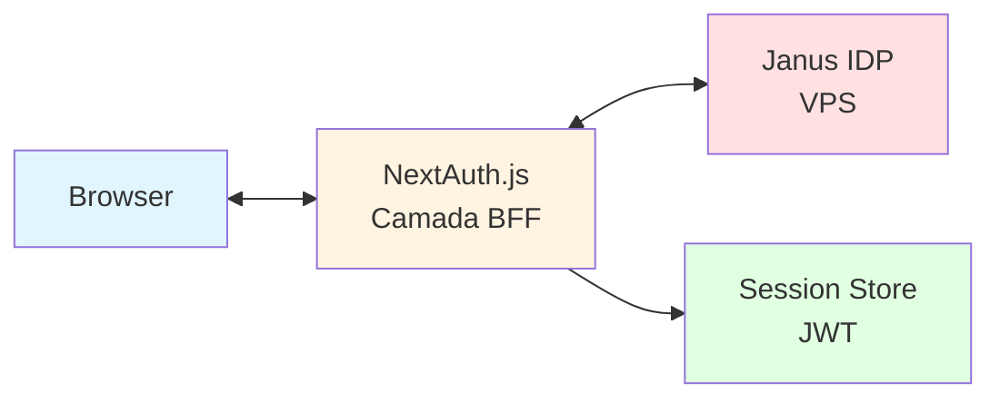
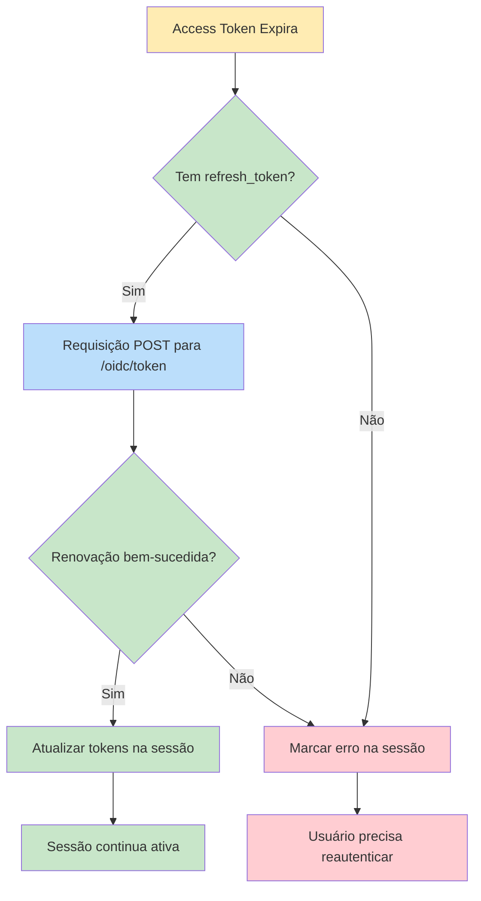

# Autenticação OAuth2 com NextAuth.js e PKCE

Este documento descreve a implementação de autenticação OAuth2 usando NextAuth.js com Janus IDP como provedor, seguindo o padrão BFF (Backend for Frontend).

## Visão Geral

O sistema de autenticação implementa:
- **OAuth2 com PKCE**: Proof Key for Code Exchange para segurança aprimorada
- **Parâmetro State**: Proteção contra CSRF
- **Gerenciamento de Tokens**: Tratamento de access_token e refresh_token
- **Renovação Automática de Tokens**: Refresh automático usando refresh_token
- **Proteção de Rotas**: Autenticação baseada em middleware
- **Fetch Autenticado**: Chamadas de API do lado do servidor com injeção automática de token

## Fluxo PKCE (Proof Key for Code Exchange)

O PKCE é um protocolo de segurança que protege contra ataques de interceptação de código de autorização. O fluxo funciona da seguinte forma:

### 1. Geração do Code Verifier
```
code_verifier = string_aleatória(43-128 caracteres)
```
- Gerado automaticamente pelo NextAuth.js
- String aleatória usando caracteres [A-Z, a-z, 0-9, -, ., _, ~]

### 2. Geração do Code Challenge
```
code_challenge = base64url(sha256(code_verifier))
```
- Hash SHA256 do code_verifier
- Codificado em base64url (sem padding)
- Gerado automaticamente pelo NextAuth.js

### 3. Redirecionamento para Autorização
```
GET http://localhost:3000/oidc/auth?
  response_type=code&
  client_id=ux-auditor&
  redirect_uri=http://localhost:3001/api/auth/callback/janus&
  scope=openid profile email offline_access&
  code_challenge=<hash gerado>&
  code_challenge_method=S256&
  state=<random string>
```

### 4. Callback no Endpoint de Token
```
POST http://localhost:3000/oidc/token
Content-Type: application/x-www-form-urlencoded

grant_type=authorization_code&
code=<código recebido no callback>&
redirect_uri=http://localhost:3001/api/auth/callback/janus&
client_id=ux-auditor&
client_secret=janus_dashboard_secret&
code_verifier=<string gerada no passo 1>
```

### 5. Resposta com Tokens
```json
{
  "access_token": "eyJhbGciOiJSUzI1NiIsInR5cCI6IkpXVCJ9...",
  "refresh_token": "eyJhbGciOiJSUzI1NiIsInR5cCI6IkpXVCJ9...",
  "token_type": "Bearer",
  "expires_in": 3600,
  "scope": "openid profile email offline_access"
}
```

## Arquitetura



## O Que Foi Implementado

### 1. Configuração do NextAuth.js com PKCE
**Arquivo:** [`../app/api/auth/[...nextauth]/route.ts`](../app/api/auth/[...nextauth]/route.ts:1)

- Provedor OAuth2 personalizado para Janus IDP
- **PKCE (Proof Key for Code Exchange)** para segurança aprimorada
- Parâmetro State para proteção contra CSRF
- Gerenciamento de tokens (access_token e refresh_token)
- Callback JWT para gerenciamento do ciclo de vida dos tokens
- Callback de sessão para expor o access_token aos componentes do servidor
- **Renovação automática de tokens usando refresh_token**

### 2. Middleware para Proteção de Rotas
**Arquivo:** [`../middleware.ts`](../middleware.ts:1)

- Protege todas as rotas do dashboard
- Redireciona usuários não autenticados para a página de login
- Suporta URL de callback para redirecionamento após login

### 3. Helper de Fetch Autenticado
**Arquivo:** [`../lib/authenticated-fetch.ts`](../lib/authenticated-fetch.ts:1)

- Fetch do lado do servidor com injeção automática de token
- Funções helper: `authenticatedGet`, `authenticatedPost`, `authenticatedPut`, `authenticatedDelete`, `authenticatedPatch`
- Tratamento de erros personalizado com [`AuthenticatedFetchError`](../lib/authenticated-fetch.ts:19)
- Chamadas de API com tipagem TypeScript

### 4. Definições de Tipos TypeScript
**Arquivo:** [`../types/next-auth.d.ts`](../types/next-auth.d.ts:1)

- Interface Session estendida com `accessToken`, `refreshToken`, `error`
- Suporte completo TypeScript para propriedades personalizadas

### 5. Páginas de Autenticação
**Arquivos:** 
- [`../app/auth/signin/page.tsx`](../app/auth/signin/page.tsx:1) - Página de login
- [`../app/auth/error/page.tsx`](../app/auth/error/page.tsx:1) - Página de erro com códigos de erro

### 6. Configuração de Ambiente
**Arquivo:** [`../.env.local.example`](../.env.local.example:1)

- Template para todas as variáveis de ambiente necessárias
- Inclui configuração do NextAuth, Janus IDP e API

## Estrutura de Arquivos

```mermaid
graph TD
    A[ux-auditor-dashboard] --> B[app]
    A --> C[lib]
    A --> D[types]
    A --> E[docs]
    A --> F[.env.local.example]
    A --> G[middleware.ts]
    
    B --> B1[api/auth/[...nextauth]/route.ts]
    B --> B2[auth/signin/page.tsx]
    B --> B3[auth/error/page.tsx]
    
    C --> C1[authenticated-fetch.ts]
    
    D --> D1[next-auth.d.ts]
    
    E --> E1[AUTHENTICATION.md]
    
    style A fill:#f5f5f5
    style B fill:#e3f2fd
    style C fill:#fff3e0
    style D fill:#f3e5f5
    style E fill:#e8f5e9
    style F fill:#fce4ec
    style G fill:#fff9c4
```

## Configuração

### Variáveis de Ambiente

Crie um arquivo `.env.local` na raiz do projeto:

```bash
# Configuração do NextAuth (v5 usa AUTH_URL e AUTH_SECRET)
AUTH_URL=http://localhost:3001
AUTH_SECRET=seu-secret-key-aqui-gerado-com-openssl-rand-base64-32

# Configuração OAuth2 do Janus IDP com PKCE
AUTH_ISSUER_URL=http://localhost:3000/oidc
AUTH_CLIENT_ID=ux-auditor
AUTH_CLIENT_SECRET=janus_dashboard_secret
AUTH_SCOPE=openid profile email offline_access

# Configuração da API
UX_AUDITOR_API_URL=http://localhost:8000
```

**Notas Importantes:**
- `AUTH_ISSUER_URL`: URL pública do issuer OIDC do Janus IDP
- `AUTH_CLIENT_ID`: Deve ser `ux-auditor` conforme especificado
- `AUTH_CLIENT_SECRET`: Deve ser `janus_dashboard_secret` conforme especificado
- `AUTH_SCOPE`: Deve incluir `offline_access` para obter refresh_token
- O callback URL deve ser registrado no Janus IDP: `http://localhost:3001/api/auth/callback/janus`

### Gerar AUTH_SECRET

```bash
openssl rand -base64 32
```

## Início Rápido

### 1. Instalar Dependências

```bash
npm install next-auth@beta
```

### 2. Configurar Variáveis de Ambiente

Copie o arquivo de exemplo e configure seus valores:

```bash
cp .env.local.example .env.local
```

Edite `.env.local`:

```bash
# Configuração do NextAuth (v5 usa AUTH_URL e AUTH_SECRET)
AUTH_URL=http://localhost:3001
AUTH_SECRET=seu-secret-key-aqui

# Configuração OAuth2 do Janus IDP com PKCE
AUTH_ISSUER_URL=http://localhost:3000/oidc
AUTH_CLIENT_ID=ux-auditor
AUTH_CLIENT_SECRET=janus_dashboard_secret
AUTH_SCOPE=openid profile email offline_access

# Configuração da API
UX_AUDITOR_API_URL=http://localhost:8000
```

Gere o `AUTH_SECRET`:

```bash
openssl rand -base64 32
```

**Importante sobre PKCE:**
- O NextAuth.js v5 implementa PKCE automaticamente
- O escopo `offline_access` é necessário para obter `refresh_token`
- O callback URL deve ser registrado no Janus IDP: `http://localhost:3001/api/auth/callback/janus`

### 3. Iniciar o Servidor de Desenvolvimento

```bash
npm run dev
```

### 4. Testar a Autenticação

1. Acesse `http://localhost:3000`
2. Você será redirecionado para `/auth/signin`
3. Clique em "Sign in with Janus IDP"
4. Complete o fluxo OAuth2
5. Você será redirecionado de volta para o dashboard

## Uso

### 1. Fazer Login

Usuários são redirecionados automaticamente para a página de login ao acessar rotas protegidas:

```tsx
// O middleware lida com isso automaticamente
// Acesse qualquer rota protegida, ex: http://localhost:3000/dashboard
// O usuário será redirecionado para /auth/signin
```

### 2. Fazer Chamadas de API Autenticadas (Server Components)

Use o helper [`authenticatedFetch`](../lib/authenticated-fetch.ts:1):

```tsx
import { authenticatedGet, authenticatedPost } from "@/lib/authenticated-fetch";

export default async function DashboardPage() {
  // Requisição GET
  const sessions = await authenticatedGet("/api/sessions");
  
  // Requisição POST
  const newSession = await authenticatedPost("/api/sessions", {
    name: "Minha Sessão",
    description: "Sessão de teste",
  });
  
  return <div>{/* Renderiza dados */}</div>;
}
```

### 3. Fazer Chamadas de API Autenticadas (API Routes)

```tsx
import { NextRequest, NextResponse } from "next/server";
import { authenticatedFetch } from "@/lib/authenticated-fetch";

export async function GET(request: NextRequest) {
  try {
    const data = await authenticatedFetch("/api/users");
    return NextResponse.json(data);
  } catch (error) {
    return NextResponse.json(
      { error: "Falha ao buscar dados" },
      { status: 500 }
    );
  }
}
```

### 4. Acessar Dados da Sessão

```tsx
import { getServerSession } from "next-auth";
import { authOptions } from "@/app/api/auth/[...nextauth]/route";

export default async function ProfilePage() {
  const session = await getServerSession(authOptions);
  
  if (!session) {
    return <div>Não autenticado</div>;
  }
  
  return (
    <div>
      <p>Access Token: {session.accessToken?.slice(0, 20)}...</p>
      <p>Usuário: {session.user?.email}</p>
    </div>
  );
}
```

### 5. Tratamento de Erros

```tsx
import { authenticatedGet, AuthenticatedFetchError } from "@/lib/authenticated-fetch";

export default async function DataPage() {
  try {
    const data = await authenticatedGet("/api/users");
    return <div>{JSON.stringify(data)}</div>;
  } catch (error) {
    if (error instanceof AuthenticatedFetchError) {
      return <div>Erro {error.status}: {error.message}</div>;
    }
    return <div>Erro desconhecido</div>;
  }
}
```

## Referência da API

### authenticatedFetch

Função principal para fazer requisições autenticadas.

```typescript
async function authenticatedFetch<T>(
  endpoint: string,
  options?: AuthenticatedFetchOptions
): Promise<T>
```

**Parâmetros:**
- `endpoint`: Endpoint da API (ex: `/api/users`)
- `options`: Opções de fetch (method, body, headers, etc.)

**Opções:**
- `baseUrl`: URL base personalizada (padrão: `UX_AUDITOR_API_URL`)
- `throwOnError`: Lançar erro em respostas não-2xx (padrão: `true`)
- `method`: Método HTTP (GET, POST, PUT, DELETE, PATCH)
- `body`: Corpo da requisição (automaticamente convertido para JSON)
- `headers`: Cabeçalhos personalizados

### Funções Helper

- [`authenticatedGet`](../lib/authenticated-fetch.ts:179): Requisições GET
- [`authenticatedPost`](../lib/authenticated-fetch.ts:193): Requisições POST
- [`authenticatedPut`](../lib/authenticated-fetch.ts:208): Requisições PUT
- [`authenticatedDelete`](../lib/authenticated-fetch.ts:223): Requisições DELETE
- [`authenticatedPatch`](../lib/authenticated-fetch.ts:238): Requisições PATCH

## Recursos de Segurança

### PKCE (Proof Key for Code Exchange)

PKCE é ativado automaticamente pelo NextAuth.js para prevenir ataques de interceptação de código de autorização. O fluxo PKCE:

1. **Code Verifier**: String aleatória de 43-128 caracteres gerada pelo cliente
2. **Code Challenge**: Hash SHA256 do code_verifier, codificado em base64url
3. **Autorização**: O code_challenge é enviado ao endpoint de autorização
4. **Troca de Token**: O code_verifier é enviado ao endpoint de token para validar o código

O NextAuth.js v5 implementa PKCE automaticamente quando a opção `checks: ["pkce", "state"]` está configurada no provedor OAuth.

### Parâmetro State

O parâmetro state é usado para prevenir ataques CSRF durante o fluxo OAuth2. O NextAuth.js gera automaticamente um state aleatório e o valida no callback.

### Armazenamento de Tokens

- **Access Token**: Armazenado na sessão JWT, acessível em componentes do servidor
- **Refresh Token**: Armazenado na sessão JWT para renovação de token
- **Cookie de Sessão**: Criptografado e assinado usando `AUTH_SECRET`

### Renovação de Tokens

O sistema implementa renovação automática de tokens usando o refresh_token:



1. Quando o access_token expira, o callback JWT detecta a expiração
2. Uma requisição é feita ao endpoint `/oidc/token` com o refresh_token
3. Novos tokens são recebidos e armazenados na sessão
4. Se a renovação falhar, um erro é marcado na sessão

**Importante**: O escopo `offline_access` deve ser incluído em `AUTH_SCOPE` para obter o refresh_token.

### Proteção de Rotas

O middleware protege todas as rotas exceto:
- `/api/auth/*`: Endpoints do NextAuth
- `/auth/*`: Páginas de autenticação
- `/_next/*`: Arquivos internos do Next.js
- Ativos estáticos

## Tratamento de Erros

### AuthenticatedFetchError

Classe de erro personalizada para erros de API:

```typescript
try {
  const data = await authenticatedFetch("/api/users");
} catch (error) {
  if (error instanceof AuthenticatedFetchError) {
    console.error(`Erro ${error.status}: ${error.message}`);
  }
}
```

### Erros de Autenticação

Usuários são redirecionados para `/auth/error` com códigos de erro:
- `Configuration`: Problema na configuração do servidor
- `AccessDenied`: Permissão negada
- `Verification`: Token expirado
- `OAuthSignin`: Erro na construção da URL de autorização
- `OAuthCallback`: Erro no tratamento da resposta do provedor OAuth

## Refresh de Token

O sistema implementa renovação automática de tokens no callback JWT. Quando o access_token expira, o sistema:

1. Detecta a expiração do token
2. Faz uma requisição POST ao endpoint `/oidc/token` com o refresh_token
3. Recebe novos tokens (access_token e opcionalmente novo refresh_token)
4. Atualiza a sessão com os novos tokens
5. Marca um erro se a renovação falhar

A implementação está completa em [`../app/api/auth/[...nextauth]/route.ts`](../app/api/auth/[...nextauth]/route.ts:93):

```typescript
// Access token expirou, tenta renová-lo usando refresh_token
if (token.refreshToken) {
  try {
    const issuerUrl = process.env.AUTH_ISSUER_URL;
    const internalUrl = process.env.AUTH_JANUS_INTERNAL_URL || issuerUrl;
    
    const response = await fetch(`${internalUrl}/token`, {
      method: "POST",
      headers: {
        "Content-Type": "application/x-www-form-urlencoded",
      },
      body: new URLSearchParams({
        grant_type: "refresh_token",
        refresh_token: token.refreshToken as string,
        client_id: process.env.AUTH_CLIENT_ID!,
        client_secret: process.env.AUTH_CLIENT_SECRET!,
      }),
    });

    if (!response.ok) {
      throw new Error("Falha ao renovar token");
    }

    const tokens = await response.json();
    
    return {
      ...token,
      accessToken: tokens.access_token,
      refreshToken: tokens.refresh_token || token.refreshToken,
      expiresAt: Date.now() + (tokens.expires_in * 1000),
    };
  } catch (error) {
    console.error("Erro ao renovar token:", error);
    return {
      ...token,
      error: "RefreshAccessTokenError",
    };
  }
}
```

**Importante**: Para que o refresh funcione, o escopo `offline_access` deve estar incluído em `AUTH_SCOPE`.

## Testes

### Desenvolvimento Local

1. Configure sua instância do Janus IDP
2. Configure as variáveis de ambiente
3. Inicie o servidor de desenvolvimento:

```bash
npm run dev
```

4. Acesse `http://localhost:3000` - você será redirecionado para fazer login

### Testar Fetch Autenticado

Crie um componente de servidor de teste:

```tsx
// app/test-auth/page.tsx
import { authenticatedGet } from "@/lib/authenticated-fetch";

export default async function TestAuthPage() {
  try {
    const data = await authenticatedGet("/api/health");
    return <div>Autenticado: {JSON.stringify(data)}</div>;
  } catch (error) {
    return <div>Erro: {(error as Error).message}</div>;
  }
}
```

## Solução de Problemas

### "Usuário não autenticado"

Verifique:
1. Usuário está logado
2. Cookie de sessão está presente
3. `AUTH_SECRET` está configurado corretamente

### "Credenciais de cliente inválidas"

Verifique:
1. `AUTH_CLIENT_ID` está configurado como `ux-auditor`
2. `AUTH_CLIENT_SECRET` está configurado como `janus_dashboard_secret`
3. Cliente está registrado no Janus IDP
4. URI de redirecionamento corresponde (ex: `http://localhost:3001/api/auth/callback/janus`)

### "Token expirado"

O sistema implementa renovação automática de tokens. Se ainda assim ocorrer erro:

1. Verifique se `offline_access` está incluído em `AUTH_SCOPE`
2. Verifique se o refresh_token está sendo retornado pelo Janus IDP
3. Verifique se o endpoint de token está acessível
4. Verifique os logs do console para erros de renovação

### "PKCE validation failed"

Verifique:
1. O provedor OAuth está configurado com `checks: ["pkce", "state"]`
2. O Janus IDP suporta PKCE
3. Não há proxies ou firewalls modificando os parâmetros da requisição

### Middleware não protegendo rotas

Verifique:
1. Middleware está na raiz do projeto (`middleware.ts`)
2. Configuração do matcher está correta
3. Sem middleware conflitante

## Resumo de Recursos de Segurança

✅ **PKCE (Proof Key for Code Exchange)** - Previne interceptação de código de autorização  
✅ **Parâmetro State** - Proteção contra CSRF  
✅ **Gerenciamento de Tokens** - Tratamento de access_token e refresh_token  
✅ **Renovação Automática de Tokens** - Refresh automático usando refresh_token  
✅ **Proteção de Rotas** - Autenticação baseada em middleware  
✅ **Cookies de Sessão Criptografados** - Assinados com `AUTH_SECRET`  
✅ **Chamadas de API com Tipagem** - Suporte completo TypeScript

## Próximos Passos

1. **Configurar o Janus IDP**: Configure sua instância do Janus IDP e registre a aplicação
2. **Atualizar URIs de Redirecionamento**: Adicione `http://localhost:3001/api/auth/callback/janus` ao seu cliente do Janus IDP
3. **Adicionar Controle de Acesso Baseado em Roles**: Estenda o middleware para controle de acesso baseado em roles
4. **Testar Integração**: Verifique o fluxo de autenticação com sua API de backend

## Melhores Práticas

1. **Sempre use fetch do lado do servidor**: Use [`authenticatedFetch`](../lib/authenticated-fetch.ts:1) em componentes do servidor e rotas de API
2. **Trate erros com elegância**: Envolva chamadas de API em blocos try-catch
3. **Proteja variáveis de ambiente**: Nunca faça commit de `.env.local` no controle de versão
4. **Use HTTPS em produção**: Sempre use HTTPS para fluxos OAuth2
5. **Valide tokens**: Considere validar assinaturas JWT na API de backend

## Recursos Adicionais

- [Documentação do NextAuth.js](https://authjs.dev/)
- [RFC do OAuth 2.0](https://tools.ietf.org/html/rfc6749)
- [RFC do PKCE](https://tools.ietf.org/html/rfc7636)
- [Documentação do Janus IDP](https://www.janus-idp.io/)
