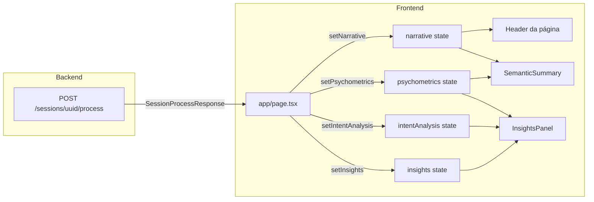
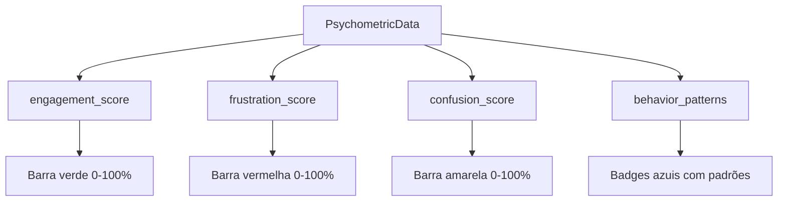
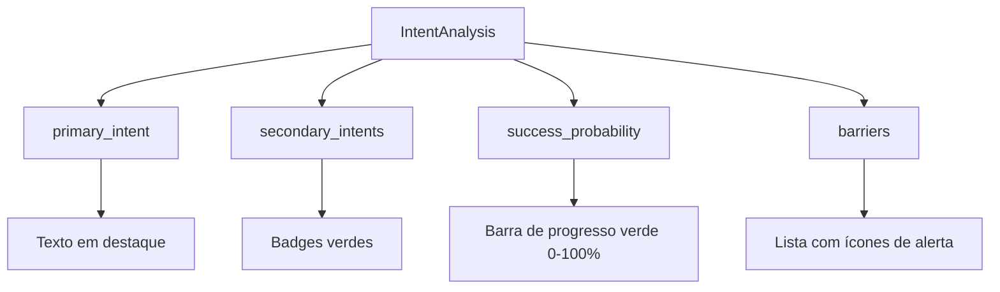
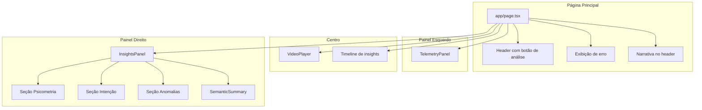

# Fluxo de Dados da Análise de IA

Este documento descreve o fluxo completo de dados desde o disparo da análise de IA até a apresentação dos resultados na interface do usuário.

## Visão Geral

O sistema de análise de UX segue o seguinte fluxo:

1. **Upload** - Usuário faz upload de arquivo de sessão rrweb
2. **Processamento** - Disparo do pipeline de IA no backend
3. **Resposta** - Backend retorna dados processados
4. **Visualização** - Frontend apresenta os resultados em painéis

## Disparo da Análise de IA

### Endpoint

```
POST /sessions/{session_uuid}/process
```

### Localização no Código

O POST para `/sessions/{session_uuid}/process` é disparado no arquivo [`app/page.tsx`](../app/page.tsx), dentro da função `triggerAnalysis()`.

**Arquivo:** [`app/page.tsx`](../app/page.tsx)  
**Função:** `triggerAnalysis()` (linhas 98-180)  
**Chamada fetch:** linhas 118-123

```typescript
const triggerAnalysis = async () => {
  // ...
  const baseUrl = process.env.NEXT_PUBLIC_UX_AUDITOR_API_URL || "http://localhost:8000";
  const endpoint = `/sessions/${sessionUuid}/process`;
  const url = `${baseUrl}${endpoint}`;

  const response = await fetch(url, {
    method: 'POST',
    headers: {
      'Content-Type': 'application/json',
    },
  });
  // ...
}
```

### Gatilho (Trigger)

A função é acionada pelo botão "Iniciar Auditoria de IA" no header da página:

```tsx
<Button
  onClick={triggerAnalysis}
  disabled={isProcessing}
  className="bg-purple-600 hover:bg-purple-700 text-white gap-2"
>
  <Sparkles className="h-4 w-4" />
  Iniciar Auditoria de IA
</Button>
```

### Pipeline de Análise no Backend

O pipeline de análise executado no backend segue as seguintes etapas:

1. **Preprocessor** - Pré-processa os eventos rrweb
2. **Isolation Forest** - Detecta anomalias estatísticas
3. **Heurísticas** - Aplica regras de UX pré-definidas
4. **LLM** - Gera insights narrativos com IA

## Estrutura da Resposta

### Interface SessionProcessResponse

```typescript
interface SessionProcessResponse {
  insights: InsightEvent[];
  narrative: string;
  psychometrics: PsychometricData;
  intent_analysis: IntentAnalysis;
}
```

### Diagrama do Fluxo de Dados



## Apresentação dos Dados

Os três campos principais retornados pela API (`narrative`, `psychometrics`, `intent_analysis`) são apresentados em locais diferentes na interface.

### 1. Narrative (string)

A narrativa é exibida em **dois lugares**:

#### a) No header da página principal

**Arquivo:** [`app/page.tsx`](../app/page.tsx) (linhas 257-262)

```tsx
{narrative && !isProcessing && (
  <div className="mx-4 mt-4 p-3 bg-purple-500/10 border border-purple-500/30 rounded-md">
    <p className="text-xs text-purple-300 font-medium mb-1">Análise da IA:</p>
    <p className="text-sm text-foreground">{narrative}</p>
  </div>
)}
```

#### b) No componente SemanticSummary

**Arquivo:** [`components/player/SemanticSummary.tsx`](../components/player/SemanticSummary.tsx) (linhas 119-123)

```tsx
<div className="p-3 bg-slate-800/50 rounded-lg border border-slate-700/30">
  <p className="text-sm text-slate-200 italic leading-relaxed">
    &ldquo;{narrative}&rdquo;
  </p>
</div>
```

### 2. Psychometrics (objeto)

Exibido no painel lateral direito, componente [`InsightsPanel`](../components/player/InsightsPanel.tsx).

**Arquivo:** [`components/player/InsightsPanel.tsx`](../components/player/InsightsPanel.tsx) (linhas 66-127)



| Campo | Tipo | Visualização |
|-------|------|--------------|
| `engagement_score` | number (0-100) | Barra de progresso verde |
| `frustration_score` | number (0-100) | Barra de progresso vermelha |
| `confusion_score` | number (0-100) | Barra de progresso amarela |
| `behavior_patterns` | string[] | Lista de badges azuis |

Também é usado no [`SemanticSummary`](../components/player/SemanticSummary.tsx) para exibir:

| Campo Convertido | Origem | Escala |
|------------------|--------|--------|
| Frustração | `frustration_score / 10` | 0-10 |
| Carga Cognitiva | `confusion_score / 10` (proxy) | 0-10 |

### 3. Intent Analysis (objeto)

Exibido no painel lateral direito, componente [`InsightsPanel`](../components/player/InsightsPanel.tsx).

**Arquivo:** [`components/player/InsightsPanel.tsx`](../components/player/InsightsPanel.tsx) (linhas 129-182)



| Campo | Tipo | Visualização |
|-------|------|--------------|
| `primary_intent` | string | Texto em destaque |
| `secondary_intents` | string[] | Badges verdes |
| `success_probability` | number (0-100) | Barra de progresso verde |
| `barriers` | string[] | Lista com ícones de alerta amarelo |

## Componentes Envolvidos

### Estrutura de Arquivos

```
ux-auditor-dashboard/
├── app/
│   └── page.tsx                      # Página principal, dispara análise
├── components/
│   └── player/
│       ├── InsightsPanel.tsx         # Painel de insights e dados processados
│       ├── SemanticSummary.tsx       # Resumo executivo com narrativa
│       ├── TelemetryPanel.tsx        # Painel de telemetria
│       └── VideoPlayer.tsx           # Player de vídeo rrweb
└── types/
    └── dashboard.ts                  # Definições TypeScript dos dados
```

### Diagrama de Componentes



## Tipos TypeScript

### InsightEvent

```typescript
interface InsightEvent {
  id: string;
  timestamp: number;
  type: string;
  severity: 'critical' | 'warning';
  message: string;
  boundingBox?: {
    x: number;
    y: number;
    width: number;
    height: number;
  };
}
```

### PsychometricData

```typescript
interface PsychometricData {
  engagement_score: number;      // 0-100
  frustration_score: number;     // 0-100
  confusion_score: number;       // 0-100
  behavior_patterns: string[];
}
```

### IntentAnalysis

```typescript
interface IntentAnalysis {
  primary_intent: string;
  secondary_intents: string[];
  success_probability: number;   // 0-100
  barriers: string[];
}
```

## Observação Importante

O componente [`InsightsPanel`](../components/player/InsightsPanel.tsx) recebe `narrative` como prop, mas **não está sendo passado** no [`app/page.tsx`](../app/page.tsx):

```tsx
<InsightsPanel 
  insights={insights} 
  currentTime={currentTime}
  psychometrics={psychometrics}
  intentAnalysis={intentAnalysis}
  // narrative={narrative}  <-- FALTANDO!
/>
```

Isso significa que a narrativa **não aparece** na seção "Resumo Executivo" do painel lateral, apenas no header da página.

### Correção Recomendada

Adicionar a prop `narrative` ao componente `InsightsPanel`:

```tsx
<InsightsPanel 
  insights={insights} 
  currentTime={currentTime}
  psychometrics={psychometrics}
  intentAnalysis={intentAnalysis}
  narrative={narrative}  // Adicionar esta linha
/>
```

## Tratamento de Erros

A função `triggerAnalysis()` implementa tratamento de erros robusto:

```typescript
try {
  // ... chamada à API
} catch (error) {
  console.error("Erro durante a análise de IA:", error);
  
  if (error instanceof Error) {
    setErrorMessage(error.message);
  } else if (typeof error === 'string') {
    setErrorMessage(error);
  } else {
    setErrorMessage("Ocorreu um erro inesperado durante a análise.");
  }
} finally {
  setIsProcessing(false);
}
```

Os erros são exibidos na interface através de um alerta visual:

```tsx
{errorMessage && (
  <div className="mx-4 mt-4 p-3 bg-destructive/10 border border-destructive/30 rounded-md flex items-center gap-2 text-destructive text-sm">
    <AlertCircle className="h-4 w-4 shrink-0" />
    <span>{errorMessage}</span>
  </div>
)}
```

## Considerações de Segurança

A chamada POST atual **não utiliza autenticação**. Se a API backend exigir autenticação, é necessário migrar para usar o helper [`authenticatedFetch`](../lib/authenticated-fetch.ts) ou passar o token de sessão no header:

```typescript
// Exemplo com autenticação
const response = await fetch(url, {
  method: 'POST',
  headers: {
    'Content-Type': 'application/json',
    'Authorization': `Bearer ${token}`,
  },
});
```

Veja mais detalhes em [`docs/AUTHENTICATION.md`](./AUTHENTICATION.md).
