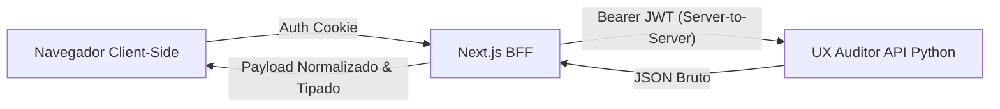

# Módulo: Referência de API e Arquitetura BFF

## 1. Visão Geral e Propósito
O **UX Auditor Dashboard** não é apenas um cliente de API tradicional; ele implementa o padrão arquitetural **Backend for Frontend (BFF)**. Este documento detalha os endpoints internos e a fundamentação teórica por trás da separação entre a camada de apresentação e os serviços de backend de IA.

## 2. Fundamentação do Padrão BFF
O padrão BFF, preconizado por Sam Newman (2015), sugere que cada interface (Web, Mobile, etc.) possua um backend específico para atender suas necessidades de UI, em vez de consumir APIs genéricas. No **UX Auditor**, o BFF assume as seguintes responsabilidades teóricas:

1.  **Orquestração de Chamadas:** O Dashboard pode consolidar dados de múltiplas fontes (IDP, Backend IA, Storage) em um único payload otimizado para a UI.
2.  **Tradução de Protocolos:** Atua como uma ponte entre o navegador (HTTPS/JSON) e o backend Python, podendo, no futuro, implementar otimizações como gRPC internamente.
3.  **Encapsulamento de Segurança:** O BFF gerencia a injeção de tokens JWT de forma segura no servidor, protegendo as credenciais de vazamentos no navegador.

## 3. Endpoints Internos do Dashboard (Next.js API Routes)

### Gerenciamento de Sessões
| Método | Endpoint | Descrição Teórica |
|--------|----------|-------------------|
| `GET` | `/api/sessions` | Recupera o histórico de sessões. Realiza a normalização de datas ISO para o locale do usuário. |
| `POST` | `/api/ingest` | Recebe o payload `rrweb`. Valida o schema contra o contrato Zod antes do armazenamento. |
| `GET` | `/api/sessions/{uuid}/raw` | Recupera o JSON bruto da sessão. Utilizado pelo motor de replay para reconstrução do DOM. |
| `GET` | `/api/sessions/{uuid}/status` | Endpoint de polling. Monitora o estado asynchonous do job de IA. |
| `POST` | `/api/sessions/{uuid}/reprocess` | Dispara o re-trigger da pipeline de IA para uma sessão existente. |

## 4. Camada de Normalização (lib/normalization.ts)
A resiliência da interface é garantida por uma camada de normalização entre o BFF e o Cliente. Formalmente, a função de normalização $N(D_{raw}) = D_{ui}$ garante que:
*   Campos ausentes tornem-se valores neutros (ex: `[]`, `""`, `0`).
*   A tipagem TypeScript permaneça íntegra, eliminando erros de `undefined` em tempo de execução.
*   Enums técnicos (ex: `JOB_STATUS_RUNNING`) sejam mapeados para strings amigáveis de UI (`Processando`).

## 5. Referências e Base Teórica
*   **Microservices Patterns (Chris Richardson, 2018):** O BFF é um padrão de design essencial para mitigar o acoplamento entre clientes e serviços de backend em arquiteturas distribuídas.
*   **Sam Newman (2015):** *Building Microservices*. Fundamentação sobre Backends for Frontends para interfaces ricas e dinâmicas.
