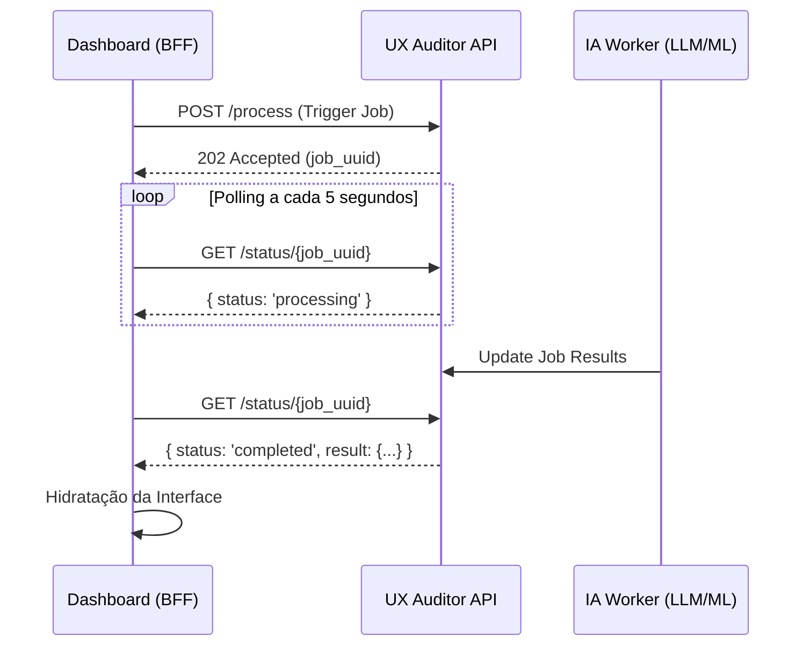

# Módulo: Fluxo de Análise e Pipelines de IA

## 1. Visão Geral e Propósito
O fluxo de análise é o coração inteligente da plataforma. Ele orquestra o processamento de dados brutos (`rrweb`) através de um pipeline multi-estágio que combina algoritmos estatísticos tradicionais com modelos de linguagem de larga escala (LLMs). Este processo transforma telemetria de baixo nível em diagnósticos de UX de alto nível.

## 2. Arquitetura do Pipeline de IA (Backend)
O processamento externo, disparado pelo Dashboard, segue as seguintes etapas teóricas:

### A. Preprocessor (Limpeza e Normalização)
Os eventos `rrweb` são filtrados para remover ruído (movimentos de mouse irrelevantes) e normalizados em uma estrutura de série temporal uniforme.

### B. Anomaly Detection (Isolation Forest)
O sistema utiliza o algoritmo **Isolation Forest** para detecção de anomalias estatísticas. 
*   **Fundamentação Teórica:** Diferente de métodos baseados em densidade, o Isolation Forest isola observações anômalas criando partições aleatórias. Anomalias (como cliques repetitivos e erráticos) são isoladas em caminhos mais curtos na árvore de decisão.
*   **Aplicação:** Identifica disparidades temporais e geográficas (coordenadas XY) que fogem do comportamento padrão de navegação humana.

### C. Heuristic Engine (Regras de UX)
Aplica heurísticas pré-definidas (ex: *Rage Clicks*, *Dead Clicks*) sobre os eventos detectados, rotulando os picos de anomalia com termos semânticos conhecidos no domínio de UX.

### D. LLM Semantic Interpretation (IA Generativa)
O estágio final utiliza um LLM (ex: GPT-4 ou Claude) para:
1.  **Geração de Narrativa:** Síntese em linguagem natural da jornada do usuário.
2.  **Análise de Intenção:** Inferência da meta do usuário com base nos elementos DOM manipulados.
3.  **Identificação de Barreiras:** Extração de obstáculos qualitativos que impediram a conclusão da tarefa.

## 3. Fluxo de Monitoramento (Polling Sequencial)
O sistema implementa um modelo de **Estado de Job Assíncrono**. Como o processamento de LLM pode ser demorado (latência de inferência), o Dashboard utiliza *polling* para sincronizar a UI sem bloquear a interação do analista.

## 4. Fundamentação Teórica dos Resultados
*   **Psicometria ($P$):** Os scores (Frustração, Confusão, Engajamento) são calculados como uma média ponderada entre as anomalias detectadas pelo Isolation Forest e os gatilhos heurísticos.
*   **Intent Analysis ($I$):** Baseia-se em análise léxica e semântica dos elementos interagidos (IDs de botões, textos de links).

## 5. Referências e Base Teórica
*   **Isolation Forest (Liu, Ting & Zhou, 2008):** Utilizado para detecção de anomalias em grandes volumes de dados de interação com baixa complexidade computacional.
*   **Large Language Models in UX (2024):** Aplicação de IA generativa para "tradução" de logs técnicos em linguagem executiva acessível a stakeholders de negócio.
