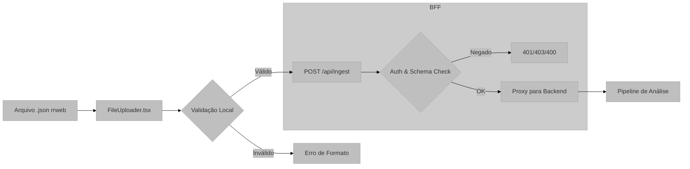

# Módulo: Ingestão de Dados e Protocolo rrweb

## Visão Geral e Propósito
O módulo de Ingestão é responsável pela admissão de dados brutos de sessões de usuário. Ele valida, sanitiza e transmite arquivos de gravação baseados no protocolo `rrweb` (Record and Replay the Web). Este módulo atua como a porta de entrada para o pipeline de análise, garantindo que apenas dados estruturalmente válidos cheguem ao motor de inferência.

## Arquitetura e Lógica

### Componente: `FileUploader.tsx`
O fluxo de ingestão inicia no cliente:
1.  **Seleção:** Usuário seleciona arquivo `.json`.
2.  **Validação Local:** O sistema verifica se o arquivo é um array JSON válido.
3.  **Transmissão:** Upload via `POST /api/ingest`.

### Endpoint: `app/api/ingest/route.ts`
Atua como gatekeeper de segurança:
1.  **Autenticação:** Verifica sessão do usuário via `next-auth` ou token JWT.
2.  **Validação de Schema:** Confirma se o payload conforma com a estrutura de eventos esperada.
3.  **Encaminhamento:** Proxy reverso autenticado para o backend de IA.

## Fundamentação Matemática
O protocolo `rrweb` baseia-se na gravação incremental de mutações do DOM. O tamanho do payload ($S$) cresce linearmente com o tempo de interação ($t$) e a complexidade da página ($C_{dom}$):

$$
S \approx \sum_{i=0}^{t} (M_i 	imes C_{dom})
$$

Onde $M_i$ representa o conjunto de mutações no instante $i$. O sistema de ingestão deve lidar com payloads que variam de KBs a MBs, exigindo streaming eficiente.

## Parâmetros Técnicos
*   **Formato de Entrada:** JSON Array de `rrweb.event`.
*   **Limite de Payload:** Configurado no `next.config.ts` (geralmente 4MB-10MB para serverless functions).
*   **Validação:** Checagem de tipo em tempo de execução (`Array.isArray`).

## Mapeamento Tecnológico e Referências

*   **Protocolo de Gravação:** **rrweb (Record and Replay the Web)**
    *   *Documentação:* [https://github.com/rrweb-io/rrweb](https://github.com/rrweb-io/rrweb)
    *   *Descrição:* Biblioteca open-source para gravar e reproduzir interações na web através de snapshots do DOM e serialização de mutações.
*   **Gerenciamento de Estado:** **React Hook Form** + **Zod**
    *   *Documentação:* [https://react-hook-form.com/](https://react-hook-form.com/) e [https://zod.dev/](https://zod.dev/)
    *   *Justificativa:* Zod permite a definição de schemas rigorosos para validar os uploads antes do envio, economizando banda e processamento no backend.

## Justificativa de Escolha
A escolha do formato **rrweb** é o padrão da indústria para "Session Replay". Diferente de gravações de vídeo (MP4/WebM), o rrweb grava o *código* (DOM), permitindo:
1.  **Lossless Quality:** Reprodução perfeita em qualquer resolução.
2.  **Acessibilidade de Dados:** O texto é selecionável e analisável por algoritmos (ao contrário de pixels em um vídeo).
3.  **Tamanho Reduzido:** Ordens de magnitude menor que vídeo rasterizado.
Isso é fundamental para o sistema de IA, que precisa "ler" o texto da tela para gerar insights semânticos, algo muito mais custoso com OCR em vídeo tradicional.
