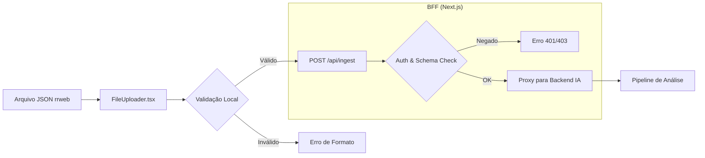

# Módulo: Ingestão de Dados e Protocolo rrweb

## 1. Visão Geral e Propósito
O módulo de ingestão é a porta de entrada para os dados brutos de interação. Ele valida e transmite arquivos de gravação baseados no protocolo **rrweb** (*Record and Replay the Web*). Este módulo garante que apenas dados estruturalmente válidos e autenticados alcancem o pipeline de análise de IA.

## 2. Fundamentação Matemática do rrweb
O protocolo `rrweb` opera através da gravação incremental de mutações no DOM (*Document Object Model*). Diferente da gravação de vídeo rasterizado (MP4/WebM), o tamanho do payload ($S$) é uma função da complexidade estrutural da página e da frequência de mutações.

Podemos formalizar o crescimento do payload como:

$$
S \approx \sum_{i=0}^{t} (M_i \times C_{dom})
$$

Onde:
*   $t$: Tempo total da interação.
*   $M_i$: Conjunto de mutações (eventos de clique, scroll, digitação, mutações estruturais) ocorridas no instante $i$.
*   $C_{dom}$: Complexidade da árvore DOM (número de nós e atributos).

### Comparação Teórica: DOM vs. Vídeo Raster
| Critério | rrweb (DOM) | Vídeo Raster (MP4) |
|----------|-------------|--------------------|
| **Qualidade** | *Lossless* (reconstrução do código) | *Lossy* (compressão de pixels) |
| **Acessibilidade** | Texto selecionável e analisável | Pixels brutos (exige OCR) |
| **Tamanho** | Ordens de magnitude menor | Volumoso (depende da resolução) |
| **Privacidade** | Permite ofuscação seletiva de campos | Mascaramento de pixels complexo |

## 3. Arquitetura de Ingestão
O fluxo de ingestão é projetado para lidar com uploads de forma assíncrona, utilizando o BFF para validar o schema antes do encaminhamento para o storage persistente.

## 4. Justificativa de Escolha
A escolha pelo **rrweb** fundamenta-se na necessidade de "ler" semanticamente a interface. Como o sistema de IA precisa identificar quais elementos (IDs, Classes, Conteúdo Textual) estão causando frustração, o acesso direto à árvore DOM serializada é superior ao processamento de imagem por visão computacional, que introduziria maior custo computacional e latência.

## 5. Referências Técnicas
*   **rrweb-io:** [github.com/rrweb-io/rrweb](https://github.com/rrweb-io/rrweb). Protocolo para serialização de snapshots e mutações do DOM em tempo real.
*   **Zod Schema Validation:** Utilizado para definir contratos rigorosos de dados, garantindo que o pipeline de IA não receba entradas malformadas que poderiam comprometer a integridade dos modelos estatísticos.
