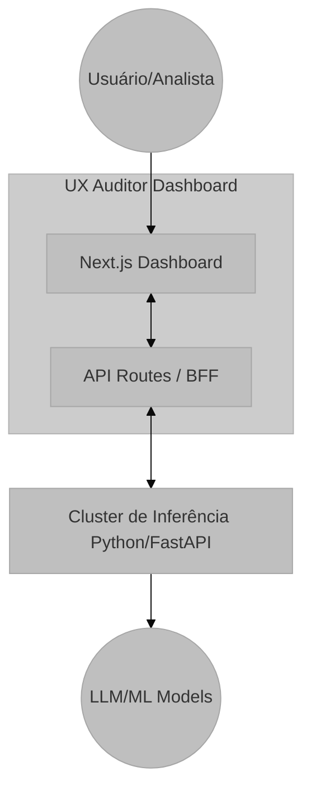

# Módulo: Visão Geral e Arquitetura do Sistema

## Visão Geral e Propósito
O **UX Auditor Dashboard** é uma plataforma de visualização de dados de usabilidade baseada em web, projetada para processar e apresentar diagnósticos gerados por inteligência artificial a partir de sessões de usuário gravadas via `rrweb`. O sistema atua como a camada de apresentação e orquestração (Frontend & BFF), consumindo uma API de backend externa responsável pelo processamento pesado (Machine Learning/LLM).

O propósito deste módulo é fornecer uma interface interativa que permite aos analistas de UX:
1.  Carregar sessões de gravação (`rrweb`).
2.  Disparar pipelines de análise remota.
3.  Visualizar métricas psicométricas e anomalias sincronizadas temporalmente com a reprodução do vídeo.

## Arquitetura e Lógica
O sistema utiliza uma arquitetura **Client-Server** baseada no framework Next.js 15, implementando o padrão **BFF (Backend for Frontend)** através de API Routes para mascarar a comunicação com os serviços de inferência e gerenciar autenticação.

### Fluxo de Dados (Macro)
1.  **Input:** Arquivo JSON contendo eventos brutos do `rrweb` (DOM snapshots e mutações).
2.  **Processamento (Proxy):** O BFF (`app/api/`) recebe os dados, anexa credenciais de segurança e encaminha para o cluster de inferência (Python/FastAPI).
3.  **Output:** O sistema recebe um objeto estruturado `SessionProcessResponse` contendo:
    *   `insights`: Lista de anomalias com timestamp.
    *   `psychometrics`: Scores de frustração, confusão e engajamento.
    *   `narrative`: Resumo em linguagem natural gerado por LLM.
4.  **Renderização:** Os componentes React hidratam a interface, sincronizando o player de vídeo com os gráficos de telemetria.

## Fundamentação Matemática
Embora o cálculo das features ocorra no backend, o frontend implementa lógica de normalização para exibição.

$$
Score_{normalized} = \frac{Score_{raw}}{10}
$$
*Onde $Score_{raw} \in [0, 100]$ e $Score_{normalized} \in [0, 10]$.*

## Parâmetros Técnicos
*   **Framework Web:** Next.js 16.1.1 (App Router).
*   **Renderização:** React Server Components (RSC) para estrutura e Client Components para interatividade (Player).
*   **Protocolo de Comunicação:** REST via `fetch` com headers de autenticação JWT injetados no servidor.
*   **Timeout de Requisição:** Configurável via `next.config.ts` para suportar latência de inferência de LLMs (padrão: 60s+).

## Mapeamento Tecnológico e Referências

*   **Framework Frontend:** **Next.js**
    *   *Documentação:* [https://nextjs.org/docs](https://nextjs.org/docs)
    *   *Citação:* Vercel. (2024). Next.js Documentation.
*   **UI Component Library:** **Shadcn/ui** (baseado em Radix UI)
    *   *Documentação:* [https://ui.shadcn.com/](https://ui.shadcn.com/)
    *   *Justificativa:* Adoção de componentes "headless" acessíveis (WAI-ARIA compliant) que permitem customização total de estilos via Tailwind CSS, crucial para manter a identidade visual "Dark/Neon" do dashboard sem bloat de CSS.
*   **Styling:** **Tailwind CSS**
    *   *Documentação:* [https://tailwindcss.com/](https://tailwindcss.com/)
    *   *Citação:* Wathan, A., & Schoger, S. (2017). Tailwind CSS.

## Justificativa de Escolha
A escolha do **Next.js** deve-se à sua capacidade de híbrida de renderização. As páginas de dashboard requerem carregamento rápido (SSR) para SEO e performance inicial, enquanto o player requer alta interatividade (CSR). O uso de **TypeScript** garante a integridade dos contratos de dados (`types/dashboard.ts`) entre o frontend e o serviço de IA, mitigando erros de tipagem comuns em manipulação de JSONs complexos de eventos `rrweb`.
