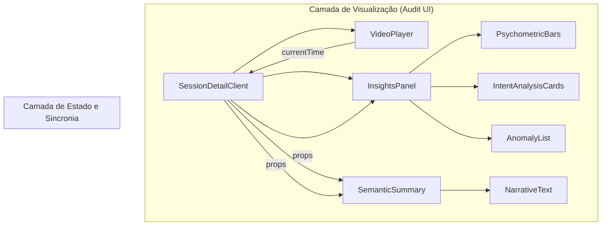

# UX Auditor Dashboard: Visão Geral e Arquitetura de Interface

## 1. Visão Geral
O **UX Auditor Dashboard** é a interface central de uma plataforma de análise de usabilidade assistida por IA. Ele foi projetado para transformar dados brutos de interação em diagnósticos acionáveis, focando na **Eficiência do Auditor** e na **Redução da Carga Cognitiva** durante o processo de auditoria de UX.

O Dashboard atua como apoio do analista, integrando visualmente a reprodução da sessão, métricas psicométricas e narrativas geradas por modelos de linguagem (LLMs).

## 2. Arquitetura de Componentes da Interface
A interface é construída modularmente no Next.js 15, dividindo as responsabilidades de visualização por domínio semântico:

### Principais Componentes:
*   **VideoPlayer:** Um reconstrutor de DOM (sandbox) que renderiza os eventos `rrweb`. É o "palco" onde a experiência do usuário é revivida.
*   **InsightsPanel:** O painel analítico direito. Ele atua como um sistema de radar, destacando informações críticas conforme a reprodução avança.
*   **SemanticSummary:** O resumo executivo. Ele apresenta a interpretação semântica da IA (o "porquê" por trás dos dados).
*   **SessionsHistoryClient:** Gerencia o repositório de auditorias passadas, permitindo a comparação histórica de diagnósticos.

## 3. Fluxo de Trabalho Assistido por IA
O Dashboard não apenas exibe dados, ele orquestra um fluxo de trabalho metodológico:

1.  **Ingestão de Sessão (Protocolo rrweb):** Captura de dados de alta fidelidade sem os custos de banda de vídeo tradicional.
2.  **Processamento Externo (Job Pipeline):** O Dashboard enfileira a análise no backend e monitora o status via polling.
3.  **Auditoria Analítica:** O analista utiliza a sincronia temporal para navegar diretamente nos pontos críticos identificados pela IA.
4.  **Exportação e Decisão:** Consolidação das barreiras e problemas encontrados para tomada de decisão de produto.

## 4. Filosofia de Interface: Design para Atenção
A interface utiliza uma estética **Dark/Neon** para:
*   Minimizar o cansaço visual em sessões longas de auditoria.
*   Destacar anomalias e insights críticos com cores de alto contraste (Roxo e Ciano).
*   Utilizar **Divulgação Progressiva** para ocultar a complexidade técnica (JSON bruto) e priorizar a narrativa semântica.

## 5. Justificativa de Escolha: Next.js + React
A escolha do Next.js justifica-se pela necessidade de um **BFF (Backend for Frontend)** integrado. O Dashboard gerencia autenticação OAuth2 segura e normalização de payloads complexos de IA no servidor antes de enviá-los para a UI, garantindo uma interface fluida e resiliente.
