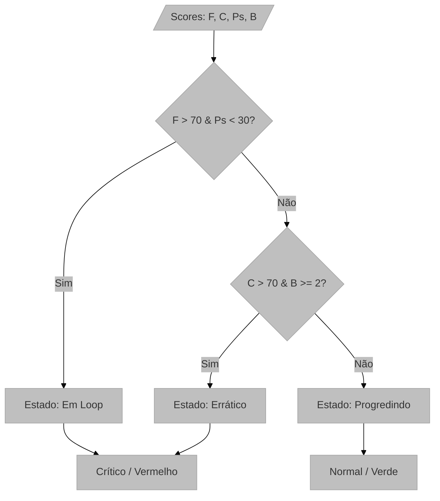

# Módulo: Diagnóstico Semântico e Heurísticas de UX

## Visão Geral e Propósito
O módulo de Diagnóstico Semântico (`SemanticDiagnostics.tsx`) é responsável por traduzir métricas quantitativas (scores numéricos) em diagnósticos qualitativos (status da jornada). Ele implementa heurísticas de especialista para categorizar a experiência do usuário em estados compreensíveis, como "Em Loop", "Errático" ou "Progredindo".

## Arquitetura e Lógica

### Classificação de Estado da Jornada
O sistema avalia a combinação de métricas psicométricas e de intenção para inferir o estado cognitivo do usuário. A lógica é encapsulada na função `determineJourneyStatus`.

1.  **Input:**
    *   `frustration_score` ($F$): 0-100
    *   `confusion_score` ($C$): 0-100
    *   `success_probability` ($P_s$): 0-100
    *   `barriers` ($B$): Lista de obstáculos identificados.

2.  **Lógica de Decisão (Árvore de Decisão):**
    *   **Caso 1: Loop (Repetição Frustrante):** Se a frustração é alta E a probabilidade de sucesso é baixa.
    *   **Caso 2: Errático (Perdido):** Se a confusão é alta E existem múltiplas barreiras.
    *   **Caso 3: Progredindo:** Caso contrário.

## Fundamentação Matemática (Heurísticas)

As regras de decisão podem ser formalizadas como:

$$
Status = 
\begin{cases} 
	ext{Looping} & 	ext{se } F > 70 \land P_s < 30 
	ext{Erratic} & 	ext{se } C > 70 \land |B| \ge 2 
	ext{Progressing} & 	ext{caso contrário}
\end{cases}
$$

### Escalonamento de Cores (Heatmap Visual)
Para visualização de scores, aplica-se uma função de transferência discretizada para cores:

$$
Color(s) = 
\begin{cases} 
	ext{Verde (Bom)} & 	ext{se } s < 3 
	ext{Amarelo (Atenção)} & 	ext{se } 3 \le s \le 7 
	ext{Vermelho (Crítico)} & 	ext{se } s > 7
\end{cases}
$$
*Onde $s$ é o score normalizado [0-10].*

## Parâmetros Técnicos
*   **Limiar de Frustração ($T_f$):** 70/100. Ponto onde a frustração é considerada obstrutiva.
*   **Limiar de Sucesso ($T_s$):** 30/100. Ponto abaixo do qual a tarefa é considerada em risco de abandono.
*   **Limiar de Confusão ($T_c$):** 70/100.

## Mapeamento Tecnológico e Referências

*   **Conceito Teórico:** **Heuristic Evaluation (Nielsen)**
    *   *Referência:* Nielsen, J. (1994). Heuristic evaluation. In Usability inspection methods.
    *   *Aplicação:* O sistema automatiza a detecção de violações de heurísticas monitorando sinais de "erro e recuperação" (loops) ou "falta de affordance" (comportamento errático).
*   **Biblioteca de UI:** **Radix UI Primitives** (Badge, Card)
    *   *Uso:* Componentes visuais para representar os estados discretos.

## Justificativa de Escolha

A decisão de implementar as heurísticas de diagnóstico semântico no **Frontend** (Client-Side) fundamenta-se em princípios de arquitetura de software, experiência do usuário e engenharia de sistemas. A análise detalhada dos trade-offs justifica essa escolha:

### Separação de Responsabilidades (Separation of Concerns)

O backend é responsável pela **inferência estatística** — processar dados brutos de telemetria e gerar scores numéricos através do modelo de IA. O frontend assume a **interpretação contextual**, transformando esses scores em estados compreensíveis para o usuário final. Esta separação segue o princípio de que:

- **Modelos de IA são genéricos por natureza**: Os scores produzidos ($F$, $C$, $P_s$) são independentes de domínio e podem ser reutilizados em diferentes contextos de interface.
- **A interpretação é específica do contexto**: O que constitui "frustração alta" pode variar conforme o tipo de aplicação, público-alvo ou jornada analisada.

### Flexibilidade e Manutenibilidade

Manter a lógica de interpretação no componente React (`SemanticDiagnostics.tsx`) oferece vantagens significativas:

1. **Calibração de Limiares sem Redeploy**: Os valores de corte ($T_f = 70$, $T_s = 30$, $T_c = 70$) podem ser ajustados via *props*, arquivo de configuração ou *feature flags*, permitindo calibração em tempo real baseada em feedback de usuários.

2. **A/B Testing de Heurísticas**: Diferentes versões dos limiares podem ser testadas simultaneamente para otimizar a precisão dos diagnósticos, sem necessidade de alterações no backend.

3. **Evolução Independente**: Novos estados de jornada (ex: "Hesitante", "Exploratório") podem ser adicionados sem impactar o contrato de API ou o modelo de IA.

### Performance e Responsividade

A execução client-side elimina a latência de round-trip para o servidor em cada atualização de diagnóstico. Considerando que:

- Os scores são atualizados em tempo real durante a reprodução do vídeo da sessão.
- A função `determineJourneyStatus` tem complexidade $O(1)$ — execução em tempo constante.
- A responsividade da UI é crítica para a experiência do analista de UX.

### Extensibilidade e Testabilidade

A implementação como função pura no frontend facilita:

- **Testes unitários isolados**: Cada regra de decisão pode ser testada independentemente com dados mockados.
- **Extensibilidade via composição**: Novas heurísticas podem ser adicionadas como funções auxiliares sem modificar a lógica existente.
- **Depuração facilitada**: O estado intermediário da classificação é inspecionável via React DevTools.

### Contrapartidas e Mitigações

| Aspecto | Desvantagem | Mitigação |
|---------|-------------|-----------|
| Consistência | Diferentes clientes podem interpretar scores de forma distinta | Documentar contrato de interpretação no API spec |
| Segurança | Lógica exposta no cliente | Heurísticas são regras de negócio não-sensíveis; scores sensíveis permanecem no backend |
| Sincronização | Risco de divergência entre versões | Versionar heurísticas e incluir versão no payload de resposta |

### Alinhamento com Padrões Arquiteturais

Esta abordagem está alinhada com o padrão **BFF (Backend for Frontend)** e o princípio de **Smart UI, Dumb Backend** para lógica de apresentação. O backend fornece dados brutos e confiáveis, enquanto o frontend aplica transformações específicas para visualização — uma separação que maximiza a coesão e minimiza o acoplamento entre as camadas do sistema.
