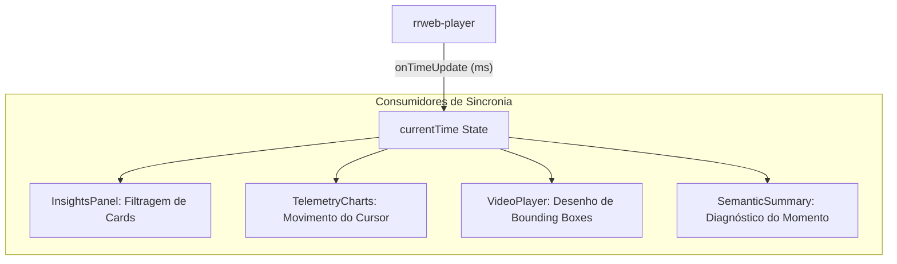

# Módulo: Motor de Visualização e Engenharia de Sincronia

## 1. Visão Geral e Propósito
O motor de visualização é o componente tecnicamente mais complexo do Dashboard. Ele não é apenas um player de vídeo, mas sim um **reconstrutor dinâmico de DOM** que opera em sincronia com metadados analíticos. Ele permite a observação do fenômeno (uso do sistema) e sua sobreposição com o diagnóstico assistido por IA.

## 2. Engenharia de Reconstrução (rrweb-player)
Diferente de frames de pixel, o Dashboard utiliza snapshots serializados da árvore DOM.

### Ciclo de Vida da Reconstrução:
1.  **Snapshot Inicial (Full Snapshot):** A base do DOM é reconstruída em um `iframe` seguro (sandbox).
2.  **Mutações (Incremental Snapshots):** Eventos como `NodeAdded`, `AttributeModified` e `TextContentModified` são aplicados em ordem cronológica.
3.  **Eventos de Interação:** Movimentos de mouse, cliques e toques são renderizados como uma camada visual separada (*virtual cursor*).

## 3. Sincronia Temporal e Injeção de Overlays
O sistema de IA envia insights com coordenadas espaciais e timestamps. O Dashboard deve projetar essas coordenadas dinamicamente sobre o DOM reconstruído.

### Transformação de Coordenadas (Bounding Box Projection)
A interface recebe as coordenadas da IA ($x, y, w, h$) e as projeta sobre o player:

$$
P_{target} = f(P_{raw}, S_{viewport}, C_{scroll})
$$

Onde:
*   $P_{raw}$: Coordenadas enviadas pela IA.
*   $S_{viewport}$: Escala do player na tela do analista.
*   $C_{scroll}$: Estado do scroll no momento $T$.

Os **Overlays** são injetados como elementos HTML (`div` com borda neon) diretamente sobre o cursor do player, garantindo que o analista veja exatamente o que a IA está analisando.

## 4. O Modelo de Observador de Tempo (React Context/State)
Para manter todos os componentes sincronizados, o Dashboard utiliza um **Single Source of Truth** para o tempo:

## 5. Estratégia de Performance (UI Responsiveness)
Como o estado de tempo muda em alta frequência (até 60 FPS), o Dashboard implementa otimizações para evitar *re-renders* pesados:
*   **Memoização:** Componentes como `InsightsPanel` utilizam `useMemo` para recalcular a lista de insights ativos apenas quando a janela temporal de 1.5s é cruzada.
*   **CSS Transitions:** As barras psicométricas utilizam transições de CSS puro para animações fluidas, movendo a carga de animação da CPU para a GPU.

## 6. Justificativa Técnica: Injeção de Insights no DOM
Ao contrário de vídeos, o uso de `rrweb` permite que o analista inspecione o código-fonte do elemento que causou o insight diretamente no player. Isso permite uma auditoria técnica profunda (ex: descobrir que um botão não tem `aria-label` ou que um ID está duplicado causando comportamento errático).
