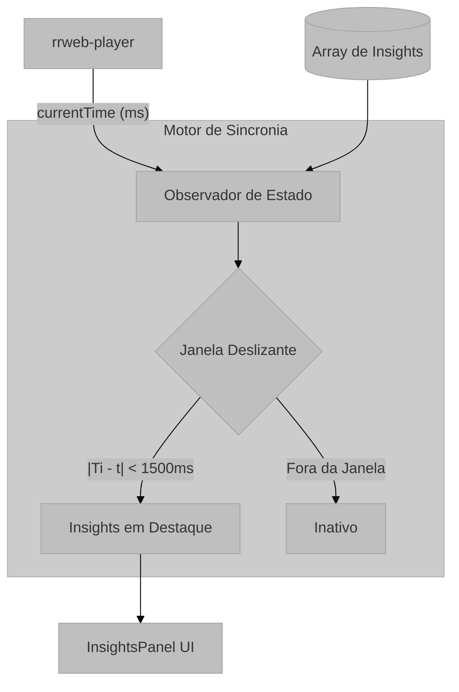

# Módulo: Motor de Visualização e Sincronia Temporal

## Visão Geral e Propósito
Este módulo é o "coração" da experiência do usuário, responsável por renderizar a reprodução da sessão (Replay) e sincronizar visualmente os dados analíticos (Insights) com o momento exato do vídeo. Ele resolve o problema de **contextualização temporal**, garantindo que uma anomalia detectada no tempo $T$ seja exibida ao usuário apenas quando o player atingir o tempo $T$.

## Arquitetura e Lógica

### Componente: `InsightsPanel.tsx`
O painel lateral atua como um observador do estado do player.

1.  **Input:**
    *   `currentTime` (number): Timestamp atual do player (ms).
    *   `insights` (InsightEvent[]): Lista completa de anomalias.
2.  **Processamento (Filtragem em Tempo Real):**
    A cada atualização de frame (tick), o componente recalcula quais insights são relevantes.
3.  **Visualização:** Renderiza cards de anomalia e atualiza as barras psicométricas.

### Lógica de Filtragem Temporal
O sistema utiliza uma **Janela Deslizante (Sliding Window)** para determinar a relevância de um insight.

$$
Relevant(i, t) \iff |T_i - t_{current}| < \Delta t
$$

*   $T_i$: Timestamp do evento de insight $i$.
*   $t_{current}$: Tempo atual do player.
*   $\Delta t$: Janela de tolerância (definida como 1500ms).

## Parâmetros Técnicos
*   **Janela de Ativação ($\Delta t$):** 1500ms. Define quanto tempo um insight permanece "em destaque" no painel.
*   **Taxa de Atualização:** Vinculada ao loop de renderização do `rrweb-player` (tipicamente 60fps ou updates de estado do React).

## Mapeamento Tecnológico e Referências

*   **Player Engine:** **rrweb-player**
    *   *Documentação:* [https://github.com/rrweb-io/rrweb-player](https://github.com/rrweb-io/rrweb-player)
    *   *Função:* Renderiza o DOM virtual e fornece hooks para controle de tempo (`currentTime`, `play`, `pause`).
*   **Componentes de Interface:** **Lucide React** (Ícones)
    *   *Documentação:* [https://lucide.dev/](https://lucide.dev/)
    *   *Uso:* Ícones semânticos para representar tipos de insights (ex: `Eye` para visualização, `AlertTriangle` para erros).

## Justificativa de Escolha
A estratégia de **filtragem no cliente** (Client-Side Filtering) foi escolhida em vez de pré-processar frames no backend.
*   **Motivo:** O array de insights é pequeno (< 100 itens típicos), permitindo que operações `Array.filter` rodem a cada renderização sem impacto de performance perceptível (O(N) onde N é pequeno).
*   **Benefício:** Permite "scrubbing" (arrastar a barra de tempo) com feedback instantâneo, sem necessidade de novas requisições ao servidor para buscar "insights do minuto atual".
